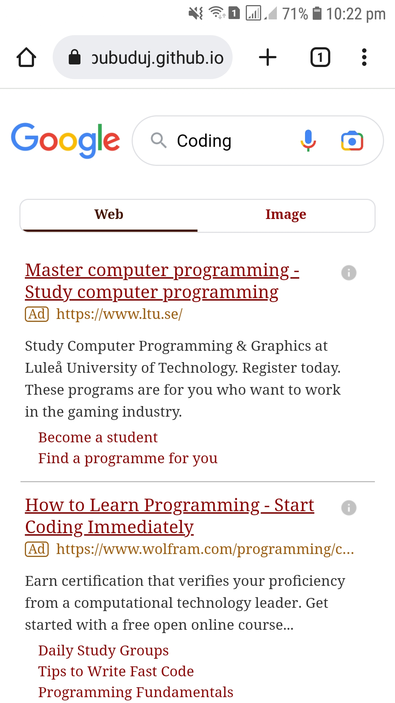

# Google Homepage Clone 

### Responsive design of the Google homepage

The Google.lk homepage was designed to practice and develop my 
web design skills. This website was developed with pure HTML and CSS. 
CSS media queries are used to make the webpage responsive.
Search results for the entered inputs are provided to the user by a 
Google programmable search engine.

#### Images of the user interfaces
1. Home page of desktop UI 
   

2. Search result page of desktop UI 
   

3. Home page of mobile UI 
   

4. Search result page of mobile UI 
   

## Used Technologies

- HTML5
- CSS3

#### Used Source-Code Editor
- Visual Studio Code

## Credits
This project was carried out under the guidance of the [IJSE](https://www.ijse.lk/) Direct Entry Program 9.

## License
Copyright &copy; 2022 [Pubudu Janith](https://www.linkedin.com/in/pubudujanith94/). All Rights Reserved. 
This project is licensed and source code is available to all under the [MIT license](LICENSE.txt).